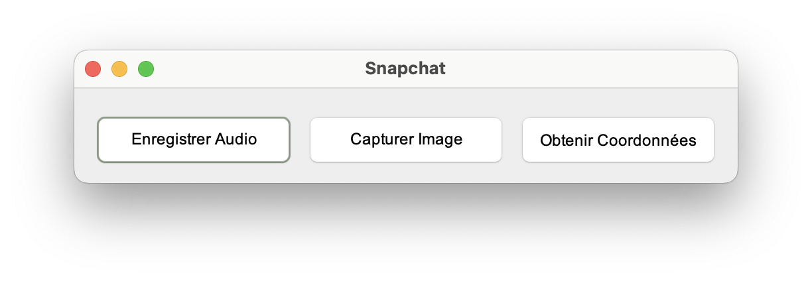
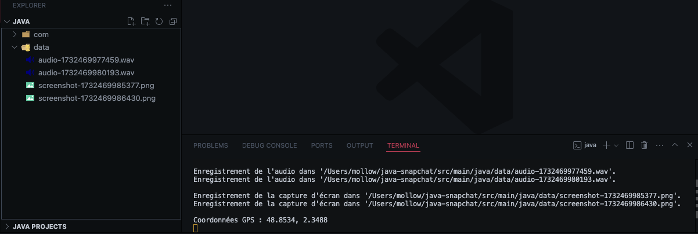

# java-snapchat

A Snapchat fonctionality clone using Java, all data (audio, screenshots) are stored in the `data` directory & all actions are logged in the console.

## installation

Compile the app
```bash
mvn clean compile
```

Run the app
```bash
mvn exec:java -D exec.mainClass="com.example.App"
```

## Features

- [x] Audio recording
- [x] Screenshots
- [x] Geolocation

## Screenshots

|  |
|---------------------------------------------|

|  |
|---------------------------------------------|

## Getting Started

This project is built using Java & Maven, and you'll need to set up a Java development environment to run and modify the project.

A few resources to get you started if this is your first Java project:

- [Installing Java on macOS](https://docs.oracle.com/en/java/javase/16/install-and-setup-jdk-macos.html)
- [Installing Java on Windows](https://docs.oracle.com/en/java/javase/16/install-and-setup-jdk-windows.html)
- [Installing Java on Linux](https://docs.oracle.com/en/java/javase/16/install-and-setup-jdk-linux.html)

To check if Java is already installed, you can run the following command in your terminal:

```bash
java -version
```

You'll also need to install Maven to manage the project dependencies:

- [Installing Maven on macOS](https://maven.apache.org/install.html)
- [Installing Maven on Windows](https://maven.apache.org/install.html)
- [Installing Maven on Linux](https://maven.apache.org/install.html)

To check if Maven is already installed, you can run the following command in your terminal:

```bash
mvn -v
```